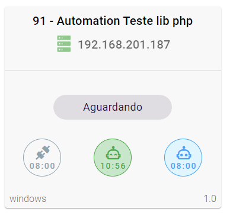

## Pré Requisitos

O **client-orchestrator** depende que alguns sistemas estejam instalados, são eles: **supervisor, cron, top, psps AMPQ e  Web socket**.

#### Instalação de pré requisito em Docker 
~~~docker
RUN apt-get update && apt-get install -y \
    cron \
    supervisor \
    procps

RUN docker-php-ext-install sockets
~~~

#### Instalação de pré requisito Ubuntu

~~~sh
apt update && apt install -y cron supervisor procps
~~~

## Instalando a lib via composer.
Uma vez instalado as dependencias basta adicionar o lib ao seu projeto com **composer**.

~~~sh
composer require grupo-cometa/client-orchestrator
~~~

## Registrando  commands.
Para que o supervisor que acesso aos commands é necessario registrar os commands em sua aplicação laravel, em  app\bootstrap\app.php.

~~~php

<?php

use GrupoCometa\ClientOrchestrator\Commands\Register;
use Illuminate\Foundation\Application;
use Illuminate\Foundation\Configuration\Exceptions;
use Illuminate\Foundation\Configuration\Middleware;

return Application::configure(basePath: dirname(__DIR__))
    ->withRouting(
        web: __DIR__ . '/../routes/web.php',
        commands: __DIR__ . '/../routes/console.php',
        health: '/up',
    )
    ->withMiddleware(function (Middleware $middleware) {
        //
    })
    ->withExceptions(function (Exceptions $exceptions) {
        //
    })
    ->withCommands([
        ...Register::commands() // registra os commandos.
    ])
    ->create();
~~~
## Criando um config.
Na raiz de seu projeto laravel em config, adicionar o arquivo **orchestrator.php**

~~~php
<?php

return [
    'orchestratorUrl'=> env('ORCHESTRATOR_URL'),
    'ssoUsername' => env('SSO_USERNAME'),
    'ssoPassword' => env('SSO_PASSWORD'),
    'ssoClientId' => env('SSO_CLIENT_ID'),
    'ssoUrl' => env('SSO_URL'),
    'wsUrl' => env('WEBSOCKET_URL'),
    'rabbitmqHost' => env('AMQP_HOST'),
    'rabbitmqPort' => env('AMQP_PORT'),
    'rabbitmqUser' => env('AMQP_USERNAME'),
    'rabbitmqPassword' => env('AMQP_PASSWORD'),  
];

~~~
## Criando um Automation
Para implementar uma automação que possa ser monitoradora pelo orquestrador basta criar um class em app\Orchestrator (diretório padrao, pode ser alterado add uma key 'namespace' =>  'App\MyBaseNamespace' no config conforme passo a cima) que extenda a abstract class **GrupoCometa\ClientOrchestrator\AbstractAutomation**
Exemplo criado no diretorio padrão: app\Orchestrator\AutomationTeste.php

~~~php
<?php

namespace App\Orchestrator;

use GrupoCometa\ClientOrchestrator\AbstractAutomation;

class AutomationTeste extends AbstractAutomation
{
    public function publicId(): string
    {
        return "ca432bbc-0b72-4b07-8848-f0f2761c15e5";
    }

    public function start()
    {

        $this->log->success('Automation teste start sucess', date('Y-m-d H:i:s'));
    }
}

~~~
Ao extentender o abstract class voce terá que implementar dois metodos **publicId e start**. Em publicId voce deve retornar uma string contento o id public da automação já criada no orquestrador, e no metodo start é a logica da sua altomação.

Essa automação de exemplo apenas registra um log no orquestrador.

## Gerando Programas Supervisor.

Uma vez que já definiu suas automações basta criar os progamas no supervisor.Execultando o seguinte comando em seu terminal.

~~~sh
php artisan orchestrator:bootstrap 
~~~
O comando ira gerar um arquivo supervisor contendo as configuração necessaria para monitorar sua automação e sincronizar agendamentos cron. Voce pode conferir se tudo saiu como esperado  visualizando o arquivo /etc/supervisor/conf.d/supervisor.conf

~~~sh
cat /etc/supervisor/conf.d/supervisor.conf
~~~
Voce dever ter uma saida parecida com

~~~sh
[supervisord]
logfile=/var/log/supervisord.log
pidfile=/var/run/supervisord.pid
childlogdir=/var/log

[program:consume-schedules-ca432bbc-0b72-4b07-8848-f0f2761c15e5]
command=/usr/local/bin/php /var/www/artisan orchestrator:consume-schedules ca432bbc-0b72-4b07-8848-f0f2761c15e5
autostart=true
autorestart=true
stdout_logfile=/var/log/automation/ca432bbc-0b72-4b07-8848-f0f2761c15e5.log
stderr_logfile=/var/log/automation/ca432bbc-0b72-4b07-8848-f0f2761c15e5.err.log
chown=root:root

[program:publish-status-ca432bbc-0b72-4b07-8848-f0f2761c15e5]
command=/usr/local/bin/php /var/www/artisan orchestrator:publish-status ca432bbc-0b72-4b07-8848-f0f2761c15e5
autostart=true
autorestart=true
stdout_logfile=/var/log/automation/ca432bbc-0b72-4b07-8848-f0f2761c15e5.log
stderr_logfile=/var/log/automation/ca432bbc-0b72-4b07-8848-f0f2761c15e5.err.log
chown=root:root
~~~

Vale resaltar que a cada nova automação criada voce deve repetir o passo a cima [Gerando Programas Superviso](#gerando-programas-supervisor)

## Inicando Supervisor

Por padrão o superviso não inicia com o sistema operacinal voce deve cuidar dessa parte. Existe varia maneiras de fazer isso vou mostrar a mais simples, voce pode ficar a vontade para fazer da forma que preferir.

~~~sh
/usr/bin/supervisord -c /etc/supervisor/conf.d/supervisor.conf
~~~

Se tudo saiu como esperado sua aplicação  vai ficar online no orquestrador

## Em caso de erros
* Reveja os passos para ter certeza que não ficou nada para traz.
* Consulte os arquivos de logs
    * /var/log/supervisord.log
    * /var/log/automation/publicid.log

# Facilitando 

### Exemplo imagem docker

~~~docker
FROM grupocometa/php8.1

WORKDIR /var/www
COPY . .

ENV TZ=America/Cuiaba

RUN echo $TZ > /etc/timezone && \
    apt-get update && apt-get install -y \
    tzdata \
    cron \
    supervisor \
    procps \
    poppler-utils \
    && \
    rm /etc/localtime && \
    ln -snf /usr/share/zoneinfo/$TZ /etc/localtime && \
    dpkg-reconfigure -f noninteractive tzdata && \
    apt-get clean

RUN docker-php-ext-install sockets

RUN composer install
RUN php artisan orchestrator:bootstrap

CMD bash -c "cron && /usr/bin/supervisord -c /etc/supervisor/conf.d/supervisor.conf && php-fpm"
~~~
